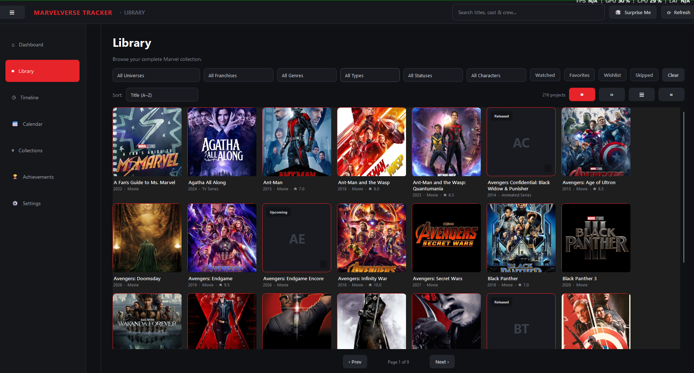
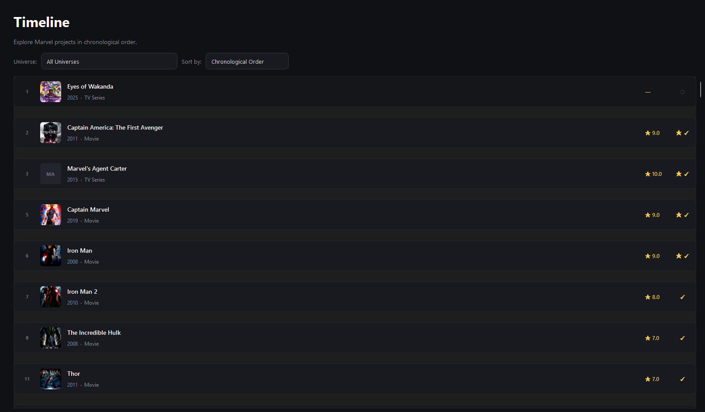
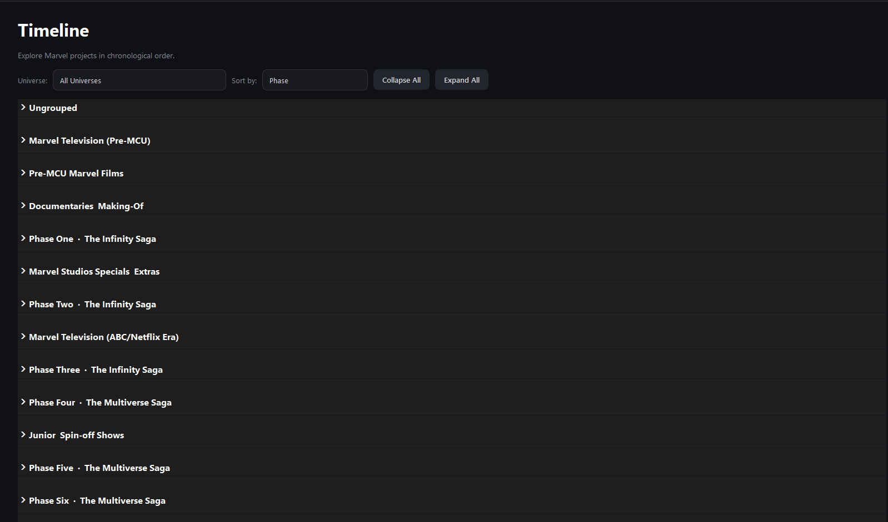
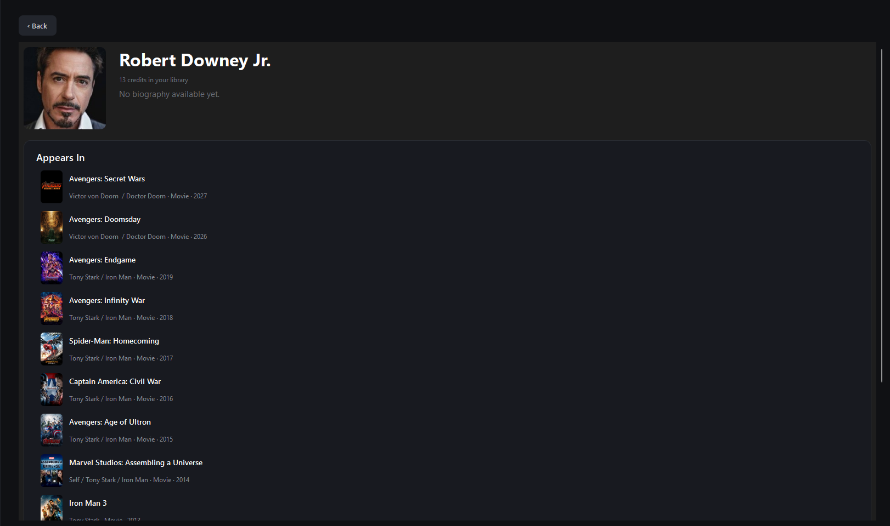
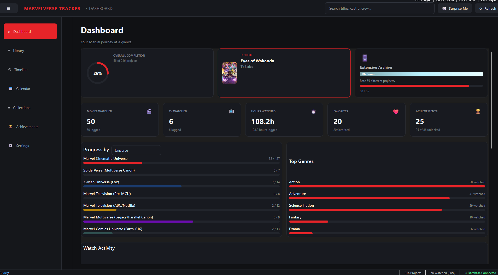
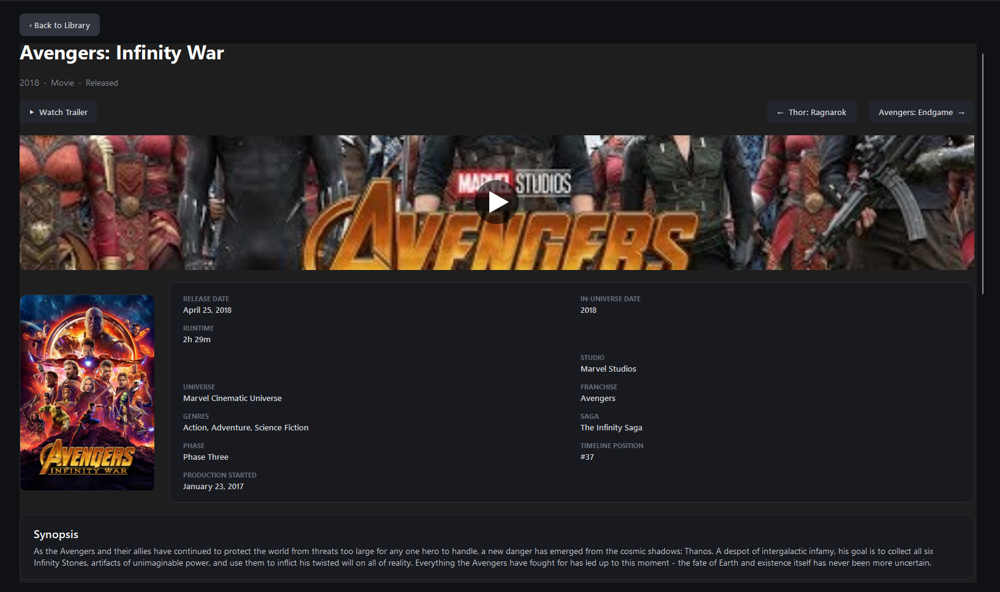
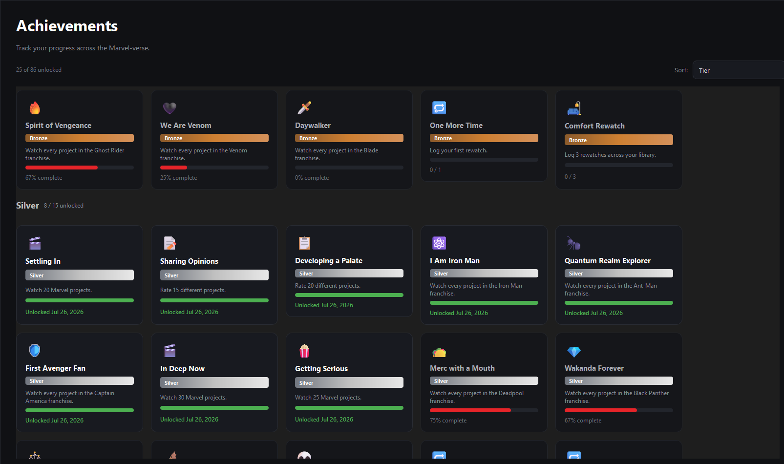
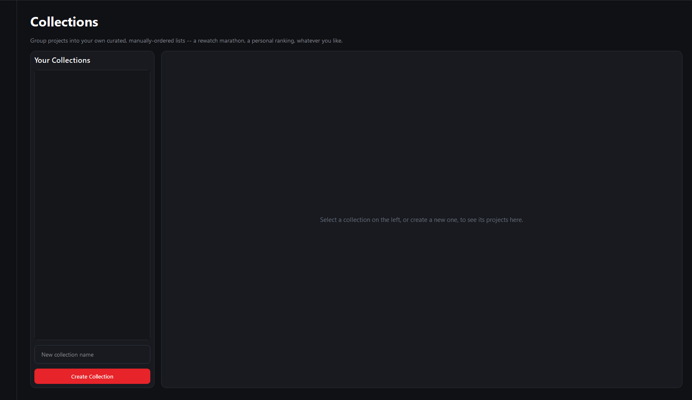

# MarvelVerse Tracker

## Disclaimer

MarvelVerse Tracker is an unofficial fan-made application created for personal and community use.

This project is not affiliated with, endorsed by, sponsored by, or approved by Marvel Entertainment, LLC or The Walt Disney Company.

Marvel and all related characters, names, logos, and other intellectual property are trademarks and/or copyrights of their respective owners.

This application does not include or redistribute copyrighted Marvel artwork, logos, movie assets, or other proprietary media.

**Attribution:** Movie/TV metadata is retrieved from [The Movie Database (TMDb)](https://www.themoviedb.org/) via its public API, in accordance with TMDb's own attribution requirements — this is separate from, and does not affect, Marvel's rights as described above. This product uses the TMDb API but is not endorsed or certified by TMDb.

A desktop app for tracking your journey through the Marvel Cinematic Universe — and everything around it: Fox's X-Men films, Sony's Spider-Man/Venom/Morbius films, the classic Blade trilogy, Netflix/ABC's Marvel shows, and more. Browse a filterable library of 190+ movies and shows, follow the story in chronological order, log what you've watched, rate and review, unlock achievements, build custom collections, and keep everything in sync with [TMDB](https://www.themoviedb.org/).

Built with Python, [PySide6](https://doc.qt.io/qtforpython/) (Qt for Python), and a local SQLite database — no account, no cloud, no subscription. Your data stays on your machine.

---

## Features

### Library
Browse your entire catalog in four view modes — Grid, Poster, List, or Compact — with filters for universe, franchise, genre, type, status, character, and your own Watched / Favorite / Wishlist / Skipped flags. Search by title *or* by cast/crew member name. Sort by title, release date, rating, or runtime. Configurable page size, with A/D or arrow-key page navigation. Hover over a card in Grid or Poster view for a moment to see a larger preview of the poster without leaving the grid.



**Sort by Marvel Character** — pick a character (Iron Man, Wolverine, Venom, Ghost Rider, and 40+ others) and see every movie or show they actually appear in, regardless of which universe or franchise it's filed under.

### Universes & Franchises
The catalog spans well beyond the MCU: the **Marvel Cinematic Universe**, Fox's **X-Men Universe** (split into its own Original Timeline, Post-Days of Future Past Timeline, Deadpool, and Independent Canon franchises), Sony's **SpiderVerse** (live-action and animated Spider-Man, Venom, Morbius), the **Marvel Multiverse** (the Raimi trilogy, the Amazing Spider-Man films, the Blade trilogy), the classic **Marvel Comics Universe (Earth-616)** legacy films (Ghost Rider, Fantastic Four, the Punisher films, and more), and **Marvel Television** both pre-MCU and ABC/Netflix era.

### Timeline
The full story in chronological order, not release order — grouped by MCU phase (with collapsible sections, plus one-click Collapse All / Expand All) or as one continuous Chronological Order run (the default view). Filter by universe. Choose which sagas (documentaries, specials, spin-offs) to leave out of the chronological view.




### Calendar
A real month-by-month calendar of every release in your library, past and future — not just what's coming up next. Jump between months, jump back to today, and click any release to open its Project Details page.

### Actor/Director Pages
Click any cast or crew member's name on a Project Details page to see their bio, photo, and every project of theirs in your library — sorted newest first, cast and crew credits kept separate since they're different kinds of contribution.



### Dashboard
Your stats at a glance: a completion ring, progress broken down by Universe or by Phase, top genres you actually watch, a 6-month watch-activity chart, an "Up Next" pick based on where you left off in the timeline, the achievement closest to unlocking, a "Coming Soon" strip with release countdowns, an "On This Day" strip surfacing anything that released on today's date in a past year, a daily Marvel trivia fact, Recently Watched, Top Rated By You, and a spotlight on one of your Collections.



### Project Details
Full details for any movie or show: synopsis, cast & crew (click a name to see their own page), release date, in-universe timeline date, production start date, runtime, studio, genres, saga/phase, and its position in the chronological timeline (with Previous/Next quick-nav buttons). Log watches and rewatches, rate on a 0–10 scale, jot notes, note who you watched it with, and toggle Favorite / Wishlist / Skipped.



**For TV shows only:** season and episode counts, cancellation/next-season dates where known, and an episode-by-episode tracker — mark individual episodes watched, or mark a whole season at once. (These fields don't show up at all on movies — there's no "Seasons" field cluttering a film's page.)

When TMDB has trailer data for a project, a clickable trailer thumbnail preview appears with a "Watch Trailer" button, opening it in your browser.

**Find on TMDB** — for any project without a linked TMDB entry (mostly titles outside the automatic sync's Marvel Studios scope — Fox/Sony/New Line films, for example), search TMDB directly by title and link it yourself. Once linked, that project gets full details pulled in: synopsis, poster/backdrop art, genres, trailer, and cast/crew.

### Achievements
86 achievements across Bronze, Silver, Gold, Platinum, and Diamond tiers (15 each), plus 10 hidden achievements and a single Marvelous-tier capstone for unlocking everything else. Sort by tier (grouped into clearly separated sections) or by recently earned. Hidden achievements show up as "???" until you actually unlock them — they reward unusual behavior (watching a whole phase in exact release order, a genuine binge-watch, watching on the exact anniversary of a release, and others) without spoiling the trick in advance.



### Collections
Build your own curated, manually-ordered lists — a rewatch marathon, a personal ranking, whatever you like — separate from the canonical Universe/Franchise groupings.



### "Surprise Me"
Can't decide what to watch? One click picks something random from what you haven't watched yet.

### Compare with a Friend
Have a friend export their own personal data (Settings → Import/Export → Export My Data) and pick their file under "Compare with a Friend" to see what you've both watched, what only you've seen, and what only they've seen, with an overlap percentage — entirely read-only, nothing is imported or merged into your own library.

### Data Integrity Checker
A one-click audit (Settings → Data & Storage) that flags likely duplicate entries, missing details on released projects (no synopsis/genres/cast/runtime), and franchise/universe assignments that don't line up with each other. Read-only — it only reports issues for you to look at, never changes anything on its own.

### Notifications
An in-app reminder when something's releasing within the week, plus an optional native OS desktop notification (via your system's notification center) specifically for anything releasing *today* — visible even if the app isn't focused.

### TMDB Sync & Backups
Pull movie/show data from TMDB with your own free API key, with an optional automatic re-sync schedule — this includes trailer data now, preferring an official trailer, falling back to an unofficial trailer, then a teaser. Create, restore, or delete full backups of your entire library and personal data, with an optional automatic backup schedule. Export/import just your personal activity (ratings, watched status, notes) separately from a full backup — handy for moving to a new install.

### Auto-Update
The packaged app checks for a newer version on startup and prompts with **Update Now** / **Update Later** if one's found — downloads and installs itself with one click. See [Checking for updates](#checking-for-updates) below for how this is set up.

### About
Tucked at the bottom of Settings: links to this repo, a Discord for support, a Buy Me a Coffee link if you'd like to support development, a keyboard shortcuts reference, a changelog link, credits for the libraries this app is built on, and diagnostics tools (open the log folder, copy version/OS/Qt info to your clipboard for a bug report).

---

## Getting Started

### Requirements
- Python 3.12 or newer
- A free [TMDB API key](https://www.themoviedb.org/settings/api) (optional but recommended — without one, you can still browse the pre-loaded catalog, but you won't be able to pull in new releases, trailers, or use Find on TMDB)

On first launch (or any launch with no key configured yet), a popup walks you through getting one, with direct links to the right TMDB pages — enter your key there and it'll immediately sync, or skip it and add one later in Settings whenever you're ready.

### Getting a TMDB API key

TMDB's API is free for non-commercial use like this. Each person running the app needs their own key — see [A note on API keys](#a-note-on-api-keys) below for why.

1. Create a free account at [themoviedb.org](https://www.themoviedb.org/signup) and verify your email.
2. Go to **[Settings → API](https://www.themoviedb.org/settings/api)** and click **Create** (or **Request an API Key** if this is your first one).
3. Choose **Developer** when asked what type of key you need — this is a personal, non-commercial use case.
4. Fill out the short application form. It asks for an application name/URL and a brief description — something like "MarvelVerse Tracker" and "Personal movie/TV tracking app" is fine. There's no review wait; the key is issued immediately.
5. On your API settings page, copy the **API Key (v3 auth)** value — a 32-character string. (Ignore the **API Read Access Token** field further down; that's a different token format this app doesn't use.)
6. In MarvelVerse Tracker, go to **Settings → TMDB Integration**, paste the key into the API Key field, and press Enter or click away — it saves automatically.

Alternatively, set a `TMDB_API_KEY` environment variable before launching the app; it always takes priority over whatever's saved in Settings, which is handy for development or CI without writing a real key to disk.

### A note on API keys

MarvelVerse Tracker doesn't (and won't) ship with a built-in TMDB key — you always need to add your own. A few concrete reasons:

- **It can't actually be hidden.** Anything embedded in distributed code or a compiled executable can be extracted trivially (a `strings` pass over the binary is enough) — there's no way to ship a secret in client-side software and have it stay secret.
- **One shared key would get rate-limited or banned almost immediately.** TMDB API keys are rate-limited per key, not per installation. If everyone running this app shared one key, sync would break for everybody the moment usage crossed TMDB's limits.
- **It's against TMDB's terms** to share a single key across an unknown number of downstream users, and a banned key is banned for everyone using it.

Getting your own key is free and takes about two minutes (see above) — you only have to do it once.

### Download the executable (easiest)

If you're on Windows and just want to run the app without installing Python, grab the latest `MarvelVerseTracker.exe` from this repo's **[Releases](https://github.com/Dehmahk/MarvelVerse-Tracker/releases)** page and run it directly — no setup required. The app checks for new versions on startup and can update itself in place, so once you've got it running you generally won't need to come back here for updates.

### Run from source

```bash
git clone https://github.com/Dehmahk/MarvelVerse-Tracker.git
cd MarvelVerse-Tracker
pip install -r requirements.txt
python main.py
```

The app ships with a pre-populated catalog (190+ Marvel projects across the MCU, Fox's X-Men films, Sony's Spider-Man/Venom/Morbius films, the Blade trilogy, and more) so there's something to browse immediately. Add your TMDB API key in **Settings → TMDB Integration** to pull in new releases, trailers, and richer detail as it's announced.

### Adding a splash screen (optional)

Drop an image named `splashscreen.png` into `packaging/assets/` (the same folder the app icon lives in). It'll show automatically the next time you launch the app — no code changes needed. If the file isn't there, the app just starts normally with no splash.

### Build a standalone executable

```bash
pip install -r requirements-dev.txt   # or just: pip install pyinstaller
pyinstaller packaging/MarvelVerseTracker.spec
```

The executable is built to `dist/MarvelVerseTracker.exe` (Windows) or `dist/MarvelVerseTracker` (macOS/Linux). On Windows, you can also just run `packaging\build_windows.bat`, which installs everything and builds it in one step.

You don't need a Windows machine to produce the real `.exe`, either — `.github/workflows/build-windows.yml` builds it automatically on GitHub's own Windows runners whenever you push a version tag (`git tag v1.0.1 && git push origin v1.0.1`), and attaches the result to a new GitHub Release. This is also what the in-app auto-update check relies on (see below).

When packaged, your data (database, poster cache, logs, settings) lives in your OS's standard per-user application-data folder rather than next to the executable:
- **Windows:** `%LOCALAPPDATA%\MarvelVerseTracker\`
- **macOS:** `~/Library/Application Support/MarvelVerseTracker/`
- **Linux:** `~/.local/share/MarvelVerseTracker/` (or `$XDG_DATA_HOME` if set)

Running from source (`python main.py`) instead keeps everything in `./data`, `./cache`, and `./logs` right next to the code, for convenience during development.

### Checking for updates

The packaged app checks this repo's latest GitHub Release on startup (in the background — it never blocks the UI) and prompts with **Update Now** / **Update Later** if a newer version is found, plus a "Check for Updates" button in Settings → About for checking on demand. **Update Now** downloads the new `.exe`, replaces the running one, and relaunches automatically.

A few things worth knowing:
- **This only applies to the packaged `.exe`.** Running from source has nothing for it to replace — you'll still be told a newer version exists, but the install action only shows up in a packaged build; from source, use `git pull` instead.
- **Releases need a real `MarvelVerseTracker.exe` attached** for the check to find anything — pushing a version tag through `build-windows.yml` handles this automatically; a release created by hand without that asset attached is invisible to the update checker.
- Version comparisons are numeric (`1.10.0` correctly counts as newer than `1.9.0`), read from the release's tag name (`vX.Y.Z`) against `version.py`'s `APP_VERSION` — keep the two in sync when you bump versions (see `version.py`'s own docstring for the release steps).

### Running tests

```bash
pip install -r requirements-dev.txt
pytest
```

---

## Settings

Every setting below saves automatically the instant you change it — there's no separate "Save" button to click. A **Reset All Settings to Default** button at the top of the Settings page puts everything back to how it was on first launch (your library, ratings, watch history, achievements, collections, backups, and TMDB API key are never affected by this — only these preferences).

**Appearance** — Dark, Light, Midnight Blue, Emerald, or Colorblind Friendly theme, accent color, font size (80–150%), Library poster card size (100–240px), whether interface animations (page-transition fades) are enabled, and whether the trailer thumbnail preview shows on Project Details.

**Library & Browsing** — Default view mode (Grid/Poster/List/Compact), default sort, how many projects to show per page, and whether upcoming/announced projects are shown by default.

**Timeline** — Default sort mode (Chronological Order by default, or Phase), and which sagas to exclude from Chronological Order (they still appear under Phase sorting).

**TMDB Integration** — Your API key, a manual "Sync from TMDB" button, and an optional automatic re-sync interval (never / 7 / 14 / 30 days).

**Data & Storage** — Poster cache size and limit, with a one-click "Clear Poster Cache" (never affects your library or personal data), and a "Run Data Integrity Check" button.

**Backups** — Create/restore/delete backups on demand, plus an optional automatic backup schedule with configurable interval and how many to retain.

**Notifications** — Achievement-unlock notifications (with an optional sound), whether routine "Saved"/"Logged" confirmations show in the status bar, and whether a native OS desktop notification shows for something releasing today.

**Personalization** — How ratings are displayed (0–10, 5-star, or thumbs up/down — this only changes the display, you still rate 0–10), date format (MM/DD/YYYY or DD/MM/YYYY), and which page opens first at launch.

**Privacy** — Whether backup deletion asks for confirmation, and a "mask ratings" toggle that hides your ratings everywhere (handy when screen sharing).

**Import / Export My Data** — Export just your personal activity as a portable JSON file, separate from a full backup, and compare your data against a friend's exported file.

**Updates** — Your current version, a manual "Check for Updates" button, and (when one's found) a "Download & Install Update" action.

**About** — Support links (this repo, Discord), a Buy Me a Coffee link, a keyboard shortcuts reference, a changelog link, credits, and diagnostics (open log folder, copy diagnostic info for a bug report).

---

## Keyboard Shortcuts

| Action | Shortcut |
|---|---|
| Previous page (Library) | `A` or `←` |
| Next page (Library) | `D` or `→` |

(Library shortcuts only apply while the Library page has focus, and are ignored while typing in a search box or other text field.)

---

## Project Structure

```
main.py                    Entry point
controllers/                ApplicationController -- wires views to services
services/                   Business logic (project_service, timeline_service,
                             achievement_service, collection_service,
                             statistics_service, tmdb_sync_service, backup_service, ...)
models/                     SQLAlchemy ORM models
database/                   Engine/session setup, Alembic migrations, seeding
views/                      PySide6 UI: pages, reusable widgets, themes
settings/                   AppConfig (settings.json) and its defaults
themes/                     Dark/Light QSS stylesheets
tests/                      pytest + pytest-qt test suite (not published to this repo)
packaging/                  PyInstaller spec, icon/splash assets, Windows build script
version.py                  App version + GitHub repo slug (for update checks)
```

## Tech Stack

- **[PySide6](https://doc.qt.io/qtforpython/)** — Qt for Python, the GUI toolkit
- **[SQLAlchemy](https://www.sqlalchemy.org/)** + **[Alembic](https://alembic.sqlalchemy.org/)** — ORM and schema migrations, on SQLite
- **[requests](https://requests.readthedocs.io/)** — TMDB API client
- **[Pillow](https://python-pillow.org/)** — poster image handling
- **[pytest](https://pytest.org/)** + **[pytest-qt](https://pytest-qt.readthedocs.io/)** — test suite

## License

MIT — see [LICENSE](LICENSE).
